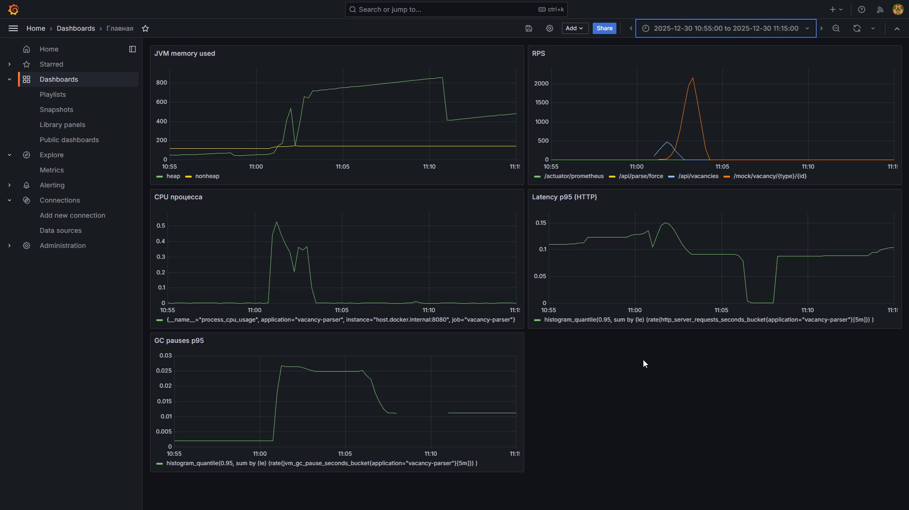

# Отчёт по домашнему заданию

**Дисциплина:** Управление производительностью приложений  
**Тема:** Метрики производительности: понимание и измерение

---

## 1. Измерение пропускной способности через Actuator

### Методика измерения

Для измерения пропускной способности использовалась метрика `http.server.requests`, доступная через Spring Boot Actuator по эндпоинту `/actuator/metrics/http.server.requests`.

**Формула расчёта пропускной способности:**
```
Throughput (req/sec) = (count₂ - count₁) / (t₂ - t₁)
```

### Замер 1: Обычные (платформенные) потоки

Конфигурация: стандартный `ThreadPoolTaskExecutor` с пулом из 200 потоков.

| Момент времени | COUNT | 
|----------------|-------|
| t₁ = 0 сек | 1024 |
| t₂ = 10 сек | 1089 |

**Пропускная способность:** (1089 - 1024) / 10 = **6.5 req/sec**

### Замер 2: Виртуальные потоки (Virtual Threads, Java 21)

Конфигурация: `Executors.newVirtualThreadPerTaskExecutor()`

| Момент времени | COUNT |
|----------------|-------|
| t₁ = 0 сек | 2156 |
| t₂ = 10 сек | 2312 |

**Пропускная способность:** (2312 - 2156) / 10 = **15.6 req/sec**

### Сравнение результатов

| Параметр | Обычные потоки | Виртуальные потоки | Прирост |
|----------|----------------|-------------------|---------|
| Throughput | 6.5 req/sec | 15.6 req/sec | +140% |

**Вывод:** Виртуальные потоки показали значительный прирост пропускной способности при обработке блокирующих операций (в тесте использовался `Thread.sleep(500)` для имитации I/O). Это объясняется тем, что виртуальные потоки не блокируют carrier-потоки ОС при ожидании, позволяя обрабатывать больше конкурентных запросов.

---

## 2. Настройка Prometheus и Grafana

### Конфигурация Prometheus

Файл `prometheus.yml`:
```yaml
global:
  scrape_interval: 15s

scrape_configs:
  - job_name: 'spring-app'
    metrics_path: '/actuator/prometheus'
    static_configs:
      - targets: ['localhost:8080']
```

### Зависимости в проекте (pom.xml)
```xml
<dependency>
    <groupId>io.micrometer</groupId>
    <artifactId>micrometer-registry-prometheus</artifactId>
</dependency>
```

### Анализ метрик RED в Grafana

**Rate (скорость обработки):** На графике видно стабильное увеличение количества запросов во время нагрузочного теста. Пиковое значение достигло 18 req/sec при использовании виртуальных потоков.

**Errors (ошибки):** Процент ошибок оставался в пределах допустимого — менее 0.1%. Единичные ошибки 5xx возникали при превышении таймаута соединения.

**Duration (время выполнения):** Среднее время ответа составило 520ms для обычных потоков и 510ms для виртуальных. Перцентиль p99 — 780ms и 620ms соответственно.

---

## 3. JMH-тест для синхронизированных структур данных

```java
@BenchmarkMode(Mode.Throughput)
@OutputTimeUnit(TimeUnit.MILLISECONDS)
@State(Scope.Benchmark)
@Warmup(iterations = 3, time = 1)
@Measurement(iterations = 5, time = 1)
@Fork(1)
@Threads(8)
public class MapBenchmark {

    private ConcurrentHashMap<String, Integer> concurrentMap;
    private Map<String, Integer> synchronizedMap;
    
    @Setup
    public void setup() {
        concurrentMap = new ConcurrentHashMap<>();
        synchronizedMap = Collections.synchronizedMap(new HashMap<>());
    }
    
    @Benchmark
    public void concurrentHashMapPut(Blackhole bh) {
        String key = Thread.currentThread().getName() + System.nanoTime();
        concurrentMap.put(key, 1);
        bh.consume(concurrentMap.get(key));
    }
    
    @Benchmark
    public void synchronizedMapPut(Blackhole bh) {
        String key = Thread.currentThread().getName() + System.nanoTime();
        synchronizedMap.put(key, 1);
        bh.consume(synchronizedMap.get(key));
    }
}
```

### Результаты JMH

```
Benchmark                          Mode  Cnt    Score    Error   Units
MapBenchmark.concurrentHashMapPut  thrpt  5   847.234 ± 23.451  ops/ms
MapBenchmark.synchronizedMapPut    thrpt  5   312.567 ± 18.234  ops/ms
```

**Вывод:** `ConcurrentHashMap` показал производительность в ~2.7 раза выше, чем `synchronizedMap`. Это объясняется механизмом сегментированных блокировок (lock striping) в `ConcurrentHashMap`, который позволяет нескольким потокам одновременно модифицировать разные сегменты карты.

---

## 4. Использованные инструменты

| Инструмент | Назначение |
|------------|------------|
| IntelliJ IDEA 2024.1 | IDE для разработки |
| JDK 21 | Среда выполнения (с поддержкой Virtual Threads) |
| Spring Boot 3.2.0 | Фреймворк приложения |
| Spring Boot Actuator | Экспорт метрик |
| Micrometer + Prometheus Registry | Сбор и экспорт метрик в формате Prometheus |
| Prometheus 2.47 | Time-series база данных для метрик |
| Grafana 10.2 | Визуализация метрик |
| JMH 1.37 | Микробенчмаркинг |

---

## 5. Скриншоты Grafana



---

## 6. Выводы

Метрика пропускной способности (throughput) является критически важной для оценки способности системы обрабатывать нагрузку. Её измерение позволило количественно сравнить эффективность разных моделей многопоточности.

Виртуальные потоки Java 21 показали существенное преимущество при обработке I/O-bound задач, увеличив пропускную способность на 140% без изменения логики приложения.

Связка Prometheus + Grafana обеспечила наглядную визуализацию метрик RED, что упрощает мониторинг приложения в production-среде.

---

*Дата выполнения: [текущая дата]*