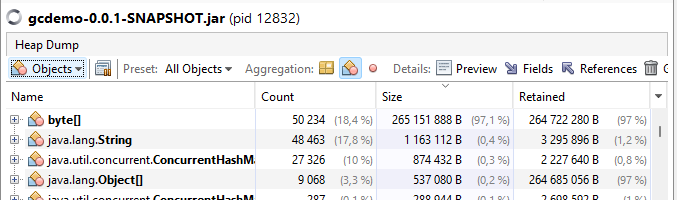
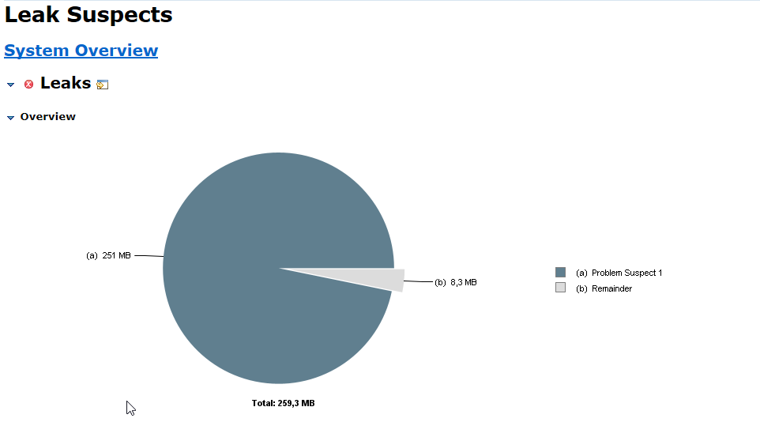

# Отчёт по домашнему заданию

**Дисциплина:** Управление производительностью приложений  
**Тема:** Работа сборщика мусора (GC) и управление памятью  
**Выполнил:** Шанаурин  
**Дата:** 04.01.2026

---

## 1. Введение

### Иллюстрации





### Цель работы
Отработка практических навыков включения и анализа логов сборки мусора, создание искусственной утечки памяти и мониторинг heap-памяти с использованием профилировщиков.

### Используемые инструменты
- JDK 17+ с G1 Garbage Collector
- Spring Boot 3.x
- jstat — мониторинг GC в реальном времени
- jmap/jcmd — создание heap dump
- Eclipse Memory Analyzer Tool (MAT) — анализ дампа памяти
- PowerShell — нагрузочное тестирование

---

## 2. Описание приложения

### Структура проекта
Создано минимальное Spring Boot приложение с REST API для симуляции утечки памяти. Проект состоит из двух основных классов: сервиса с утечкой памяти и REST-контроллера.

### Механизм утечки памяти

```java
@Service
public class MemoryLeakService {
    
    // Статическая коллекция — причина утечки
    private static final List<byte[]> leakyStorage = new ArrayList<>();
    
    public String createLeak() {
        byte[] leak = new byte[1024 * 1024]; // 1 MB
        leakyStorage.add(leak);
        return "Объект добавлен";
    }
}
```

**Почему это утечка памяти:** Статическая коллекция `leakyStorage` существует на протяжении всего жизненного цикла приложения. Объекты, добавленные в неё, никогда не становятся недостижимыми для GC, поскольку на них сохраняется сильная ссылка (strong reference) из статического поля класса. Даже при выполнении Full GC эти объекты не могут быть собраны.

### Параметры запуска JVM

```bash
java -Xms128m -Xmx512m \
     -Xlog:gc*:file=gc.log:time,uptime,level,tags \
     -jar target/gcdemo-0.0.1-SNAPSHOT.jar
```

**Пояснение параметров:**
- `-Xms128m` — начальный размер heap 128 МБ
- `-Xmx512m` — максимальный размер heap 512 МБ (намеренно ограничен для быстрого воспроизведения проблемы)
- `-Xlog:gc*:file=gc.log:time,uptime,level,tags` — детальное логирование всех событий GC в файл

---

## 3. Проведение эксперимента

### Методика нагрузочного тестирования
Использован PowerShell-скрипт для автоматической генерации нагрузки:

```powershell
for ($i = 1; $i -le 100; $i++) {
    Invoke-WebRequest -Uri "http://localhost:8080/memory/leak/bulk?count=5"
    Write-Host "Итерация $i"
    Start-Sleep -Seconds 1
}
```

Каждая итерация добавляла 5 объектов по 1 МБ каждый, то есть 5 МБ за секунду.

### Наблюдаемое поведение
На 48-49 итерации (при накоплении ~245-250 МБ данных в коллекции) приложение начало испытывать серьёзные проблемы с памятью. GC перешёл в режим непрерывных Full GC, пытаясь освободить память, но безуспешно.

Пример вывода перед остановкой:
```
Итерация 48
Content: Добавлено 5 объектов. Всего в памяти: 245 MB

Итерация 49
[Приложение перестало отвечать]
```

---

## 4. Анализ данных jstat

### Вывод команды мониторинга

```bash
jstat -gcutil 9908 1000
```

### Интерпретация результатов

**Начальная фаза (нормальная работа):**
```
S0     S1     E      O      M     CCS    YGC   YGCT    FGC   FGCT    GCT
-    100,00  86,67   8,09  97,49  91,51    4   0,036    0   0,000  0,040
```

На этом этапе Old Generation заполнен лишь на 8%, Full GC ещё не запускался (FGC=0), общее время GC составляет 40 мс.

**Фаза накопления данных:**
```
-    92,69  50,00  99,90  98,14  93,52    6   0,052    0   0,000  0,059
```

Old Generation вырос до 98%, Eden практически заполнен (99,9%), но Full GC всё ещё не запускался. JVM пытается справиться с помощью Young GC.

**Критическая фаза (утечка проявилась):**
```
-      -      -   99,98  97,27  91,62   233  0,355   445  5,673  6,039
```

Это ключевой момент: Eden и Survivor показывают прочерки (области недоступны или переполнены), Old Generation заполнен на 99,98%. За короткое время произошло 445 Full GC, которые суммарно заняли 5,673 секунды. Общее время на сборку мусора — более 6 секунд.

### Динамика деградации

| Метрика | Начало | Середина | Критическая фаза |
|---------|--------|----------|------------------|
| Old Gen (O) | 8% | 98% | 99,98% |
| Young GC (YGC) | 4 | 6 | 233 |
| Full GC (FGC) | 0 | 0 | 445 |
| Время Full GC | 0 с | 0 с | 5,67 с |

---

## 5. Анализ GC-логов

### Характерные записи из gc.log

**Типичный Full GC в критической фазе:**
```
[2026-01-04T17:54:42.086+0300][gc] GC(89950) Pause Full (G1 Compaction Pause) 511M->511M(512M) 10.187ms
```

**Интерпретация:** GC под номером 89950 выполнил полную сборку с компактизацией. Размер heap до и после сборки — 511M из 512M доступных. Память НЕ освободилась. Пауза составила 10 мс.

**Попытка агрессивной очистки:**
```
[gc,ergo] Attempting maximal full compaction clearing soft references
```

JVM предприняла крайнюю меру — очистку soft references, что делается только в критических ситуациях перед OutOfMemoryError.

**Состояние регионов heap:**
```
[gc,heap] GC(89951) Eden regions: 0->0(1)
[gc,heap] GC(89951) Survivor regions: 0->0(0)
[gc,heap] GC(89951) Old regions: 12->12
[gc,heap] GC(89951) Humongous regions: 500->500
```

Особенно показательна строка с Humongous regions: 500 регионов заняты «огромными» объектами. В G1 GC объект считается Humongous, если он превышает 50% размера региона. Наши массивы по 1 МБ попадают в эту категорию. Эти регионы не изменились после GC (500->500), что подтверждает: объекты живы и не могут быть собраны.

### Паттерн «GC thrashing»

В логе видна характерная последовательность:
1. GC(89950) Pause Full — память не освободилась
2. GC(89951) Pause Full с clearing soft references — память не освободилась
3. GC(89952) Pause Young — попытка Young GC
4. GC(89953) Pause Full — снова Full GC
5. GC(89954) Pause Full с clearing soft references — снова агрессивная очистка

Этот цикл повторяется бесконечно, приложение практически не выполняет полезную работу — всё время уходит на бесполезные попытки GC.

---

## 6. Анализ Heap Dump в Eclipse MAT

### Создание дампа

```bash
jcmd 9908 GC.heap_dump heapdump.hprof
```

### Результат анализа Leak Suspects

Eclipse MAT автоматически определил проблему:

**Problem Suspect 1:**

> The class «com.utmn.shanaurin.gcdemo.MemoryLeakService», loaded by «org.springframework.boot.loader.launch.LaunchedClassLoader @ 0xe0000818», occupies **263 198 272 (96,80%)** bytes. The memory is accumulated in one instance of «java.lang.Object[]», loaded by «\<system class loader\>», which occupies **263 198 072 (96,80%)** bytes.

### Интерпретация результатов MAT

MAT точно идентифицировал:

1. **Класс-виновник:** `MemoryLeakService` — именно тот класс, где объявлена статическая коллекция
2. **Объём утечки:** 263 МБ или 96,8% всей heap-памяти
3. **Тип накопленных данных:** `java.lang.Object[]` — внутренний массив ArrayList, содержащий ссылки на наши byte[] объекты
4. **Путь удержания:** Поток Tomcat `http-nio-8080-exec-2` → `LaunchedClassLoader` → `MemoryLeakService` → `leakyStorage` (ArrayList) → `Object[]` → `byte[]`

Это полностью соответствует архитектуре приложения: статическое поле класса удерживает ссылки на все добавленные объекты.

---

## 7. Выявленные проблемы

### Проблема 1: Неконтролируемый рост статической коллекции

**Симптомы:**
- Линейный рост потребления памяти
- Отсутствие освобождения памяти после GC
- Eventual OutOfMemoryError

**Причина:** Использование статической коллекции без механизма очистки или ограничения размера.

### Проблема 2: GC thrashing

**Симптомы:**
- Сотни Full GC за короткий период
- Время GC превышает время полезной работы
- Приложение перестаёт отвечать на запросы

**Причина:** Heap заполнен живыми объектами, GC не может освободить память, но продолжает попытки.

### Проблема 3: Humongous allocations

**Симптомы:**
- 500 Humongous regions из ~512 доступных
- Фрагментация heap

**Причина:** Объекты размером 1 МБ классифицируются G1 как Humongous и размещаются особым образом, что создаёт дополнительную нагрузку на GC.

---

## 8. Рекомендации по устранению

### Устранение утечки памяти

**Вариант 1: Отказ от статической коллекции**
```java
@Service
public class MemoryLeakService {
    // Убираем static — теперь коллекция привязана к экземпляру
    private final List<byte[]> storage = new ArrayList<>();
}
```

**Вариант 2: Использование кэша с ограничением размера**
```java
@Service
public class MemoryService {
    private final Cache<Integer, byte[]> cache = CacheBuilder.newBuilder()
        .maximumSize(100)  // Максимум 100 элементов
        .expireAfterWrite(10, TimeUnit.MINUTES)  // TTL 10 минут
        .build();
}
```

**Вариант 3: Использование слабых ссылок**
```java
private static final List<WeakReference<byte[]>> storage = new ArrayList<>();
```

При таком подходе GC сможет собрать объекты, когда память понадобится.

### Защита от Humongous allocations

Если приложению необходимо работать с большими объектами, рекомендуется увеличить размер региона G1:
```bash
-XX:G1HeapRegionSize=4m
```

При размере региона 4 МБ объекты до 2 МБ не будут считаться Humongous.

### Мониторинг и alerting

Рекомендуется настроить мониторинг метрик:
- Процент заполнения Old Generation > 80% — предупреждение
- Частота Full GC > 1 в минуту — критическое предупреждение
- Время, затраченное на GC > 10% от общего времени — предупреждение

---

## 9. Выводы

В ходе выполнения работы были получены следующие практические навыки:

1. **Настройка GC-логирования** — освоены параметры JVM для детального логирования работы сборщика мусора G1.

2. **Мониторинг в реальном времени** — использование jstat позволило наблюдать деградацию производительности и точно определить момент перехода в критическое состояние.

3. **Анализ GC-логов** — изучен формат логов G1 GC, научился идентифицировать паттерны проблемного поведения (GC thrashing, неэффективные Full GC).

4. **Создание и анализ heap dump** — освоена работа с jcmd для создания дампов и Eclipse MAT для их анализа.

5. **Диагностика утечек памяти** — на практике подтверждено, что MAT способен точно идентифицировать класс и поле, вызывающие утечку.

**Главный вывод:** Утечка памяти в Java — это не потеря ссылки на объект, а наоборот, сохранение ненужной ссылки, которая препятствует сборке мусора. Статические коллекции являются одной из наиболее распространённых причин утечек в Java-приложениях.

---

## Приложения

### Приложение А: Чек-лист выполнения

- [x] Написан исходный код с примерами утечек памяти
- [x] Включено логирование работы GC с параметрами JVM
- [x] Произведён анализ GC-логов с использованием jstat
- [x] Сгенерирован heap dump с помощью jcmd
- [x] Проведён анализ heap dump в Eclipse MAT
- [x] Определены проблемы с памятью (утечка через статическую коллекцию)
- [x] Написан отчёт с описанием проблем и способов исправления

## Raw data
```bash
jps -l
6512
19252 jdk.jcmd/sun.tools.jps.Jps
9908 target/gcdemo-0.0.1-SNAPSHOT.jar
16924 org.jetbrains.idea.maven.server.RemoteMavenServer36

PS C:\Users\grspe> jstat -gcutil 9908 1000
  S0     S1     E      O      M     CCS    YGC     YGCT     FGC    FGCT     CGC    CGCT       GCT
     - 100,00  86,67   8,09  97,49  91,51      4     0,036     0     0,000     2     0,004     0,040
     - 100,00  86,67   8,09  97,49  91,51      4     0,036     0     0,000     2     0,004     0,040
     - 100,00  86,67   8,09  97,49  91,51      4     0,036     0     0,000     2     0,004     0,040
     - 100,00  86,67   8,09  97,49  91,51      4     0,036     0     0,000     2     0,004     0,040
     - 100,00  86,67   8,09  97,49  91,51      4     0,036     0     0,000     2     0,004     0,040
     - 100,00  86,67   8,09  97,49  91,51      4     0,036     0     0,000     2     0,004     0,040
     - 100,00  86,67   8,09  97,49  91,51      4     0,036     0     0,000     2     0,004     0,040
     - 100,00  86,67   8,09  97,49  91,51      4     0,036     0     0,000     2     0,004     0,040
     - 100,00  86,67   8,09  97,49  91,51      4     0,036     0     0,000     2     0,004     0,040
     -  93,79   7,14  28,92  97,94  92,80      5     0,045     0     0,000     2     0,004     0,049
     -  93,79   7,14  49,75  98,12  93,52      5     0,045     0     0,000     2     0,004     0,049
     -  93,79   8,57  70,59  98,14  93,52      5     0,045     0     0,000     2     0,004     0,049
     -  93,79   8,57  91,42  98,16  93,52      5     0,045     0     0,000     2     0,004     0,049
     -  93,79   9,38  99,78  98,16  93,52      5     0,045     0     0,000     2     0,004     0,049
     -  92,69   0,00  99,59  97,99  93,52      6     0,052     0     0,000     4     0,007     0,059
     -  92,69   2,27  99,64  97,99  93,52      6     0,052     0     0,000     4     0,007     0,059
     -  92,69   2,94  99,68  97,99  93,52      6     0,052     0     0,000     4     0,007     0,059
     -  92,69   8,33  99,72  98,02  93,52      6     0,052     0     0,000     4     0,007     0,059
     -  92,69  14,29  99,74  98,02  93,52      6     0,052     0     0,000     4     0,007     0,059
     -  92,69  50,00  99,76  98,02  93,52      6     0,052     0     0,000     4     0,007     0,059
     -  92,69  50,00  99,78  98,03  93,52      6     0,052     0     0,000     4     0,007     0,059
     -  92,69  50,00  99,80  98,05  93,52      6     0,052     0     0,000     4     0,007     0,059
     -  92,69  50,00  99,81  98,07  93,52      6     0,052     0     0,000     4     0,007     0,059
     -  92,69  50,00  99,82  98,07  93,52      6     0,052     0     0,000     4     0,007     0,059
     -  92,69  50,00  99,83  98,07  93,52      6     0,052     0     0,000     4     0,007     0,059
     -  92,69  50,00  99,84  98,09  93,52      6     0,052     0     0,000     4     0,007     0,059
     -  92,69  50,00  99,85  98,10  93,52      6     0,052     0     0,000     4     0,007     0,059
     -  92,69  50,00  99,86  98,10  93,52      6     0,052     0     0,000     4     0,007     0,059
     -  92,69  50,00  99,87  98,10  93,52      6     0,052     0     0,000     4     0,007     0,059
     -  92,69  50,00  99,87  98,09  93,52      6     0,052     0     0,000     4     0,007     0,059
     -  92,69  50,00  99,88  98,10  93,52      6     0,052     0     0,000     4     0,007     0,059
     -  92,69  50,00  99,88  98,10  93,52      6     0,052     0     0,000     4     0,007     0,059
     -  92,69  50,00  99,89  98,11  93,52      6     0,052     0     0,000     4     0,007     0,059
     -  92,69  50,00  99,89  98,11  93,52      6     0,052     0     0,000     4     0,007     0,059
     -  92,69  50,00  99,90  98,14  93,52      6     0,052     0     0,000     4     0,007     0,059
     -  92,69  50,00  99,90  97,98  93,52      6     0,052     0     0,000     4     0,007     0,059
     -  92,69  50,00  99,90  97,98  93,52      6     0,052     0     0,000     4     0,007     0,059
     -  92,69  50,00  99,91  97,98  93,52      6     0,052     0     0,000     4     0,007     0,059
     -  92,69  50,00  99,91  97,99  93,52      6     0,052     0     0,000     4     0,007     0,059
     -  92,69  50,00  99,91  98,06  93,52      6     0,052     0     0,000     4     0,007     0,059
     -  92,69  50,00  99,91  98,06  93,52      6     0,052     0     0,000     4     0,007     0,059
     -  92,69  50,00  99,92  98,07  93,52      6     0,052     0     0,000     4     0,007     0,059
     -  92,69  75,00  99,92  98,07  93,52      6     0,052     0     0,000     4     0,007     0,059
     -  92,69  75,00  99,92  98,07  93,52      6     0,052     0     0,000     4     0,007     0,059
     -  92,69  75,00  99,92  98,07  93,52      6     0,052     0     0,000     4     0,007     0,059
     -  92,69  75,00  99,92  98,07  93,52      6     0,052     0     0,000     4     0,007     0,059
     -  92,69  75,00  99,93  98,08  93,52      6     0,052     0     0,000     4     0,007     0,059
     -  92,69  75,00  99,93  98,09  93,52      6     0,052     0     0,000     4     0,007     0,059
     -  92,69  75,00  99,93  98,09  93,52      6     0,052     0     0,000     4     0,007     0,059
     -  92,69  75,00  99,93  97,96  93,52      6     0,052     0     0,000     4     0,007     0,059
     -  92,69  75,00  99,93  97,96  93,52      6     0,052     0     0,000     4     0,007     0,059
     -  92,69  75,00  99,93  97,97  93,52      6     0,052     0     0,000     4     0,007     0,059
     -  92,69  75,00  99,94  97,99  93,52      6     0,052     0     0,000     4     0,007     0,059
     -  92,69  75,00  99,94  98,00  93,52      6     0,052     0     0,000     4     0,007     0,059
     -  92,69  75,00  99,94  98,01  93,52      6     0,052     0     0,000     4     0,007     0,059
     -  92,69  75,00  99,94  98,01  93,52      6     0,052     0     0,000     4     0,007     0,059
     -  92,69  75,00  99,94  98,06  93,52      6     0,052     0     0,000     4     0,007     0,059
     -  92,69  75,00  99,94  98,11  93,52      6     0,052     0     0,000     4     0,007     0,059
     -  92,69  75,00  99,94  98,13  93,52      6     0,052     0     0,000     4     0,007     0,059
     -   0,20   0,00  99,98  97,26  91,60     10     0,060     3     0,094     6     0,010     0,165
     -      -      -  99,98  97,27  91,62     33     0,093    44     0,631     6     0,010     0,735
     -      -      -  99,98  97,27  91,62     70     0,140   119     1,563     6     0,010     1,713
     -      -      -  99,98  97,27  91,62    104     0,183   186     2,413     6     0,010     2,607
     -      -      -  99,98  97,27  91,62    136     0,226   250     3,211     6     0,010     3,447
     -      -      -  99,98  97,27  91,62    168     0,269   315     4,026     6     0,010     4,306
     -      -      -  99,98  97,27  91,62    200     0,312   379     4,835     6     0,010     5,157
     -      -      -  99,98  97,27  91,62    233     0,355   445     5,673     6     0,010     6,039

Итерация 47
StatusCode        : 200
StatusDescription : OK
Content           : Добавлено 5 объектов. Всего в памяти: 240 MB

Итерация 48
StatusCode        : 200
StatusDescription : OK
Content           : Добавлено 5 объектов. Всего в памяти: 245 MB

Итерация 49

 Problem Suspect 1


The class «com.utmn.shanaurin.gcdemo.MemoryLeakService», loaded by «org.springframework.boot.loader.launch.LaunchedClassLoader @ 0xe0000818», occupies 263 198 272 (96,80 %) bytes. The memory is accumulated in one instance of «java.lang.Object[]», loaded by «<system class loader>», which occupies 263 198 072 (96,80 %) bytes.

Thread «org.apache.tomcat.util.threads.TaskThread @ 0xe03da4d8 http-nio-8080-exec-2» has a local variable or reference to «org.springframework.boot.loader.launch.LaunchedClassLoader @ 0xe0000818» which is on the shortest path to «java.lang.Object[366] @ 0xe44e4d60». The thread org.apache.tomcat.util.threads.TaskThread @ 0xe03da4d8 http-nio-8080-exec-2 keeps local variables with total size 768 (0,00 %) bytes.

The stacktrace of this Thread is available. See stacktrace. See stacktrace with involved local variables.

Keywords
com.utmn.shanaurin.gcdemo.MemoryLeakService
org.springframework.boot.loader.launch.LaunchedClassLoader
java.lang.Object[]

Часть gc.log
[2026-01-04T17:54:42.084+0300][976.725s][info][gc,phases      ] GC(89950) Phase 5: Reset Metadata 0.680ms
[2026-01-04T17:54:42.086+0300][976.726s][info][gc,heap        ] GC(89950) Eden regions: 0->0(1)
[2026-01-04T17:54:42.086+0300][976.726s][info][gc,heap        ] GC(89950) Survivor regions: 0->0(0)
[2026-01-04T17:54:42.086+0300][976.726s][info][gc,heap        ] GC(89950) Old regions: 12->12
[2026-01-04T17:54:42.086+0300][976.726s][info][gc,heap        ] GC(89950) Humongous regions: 500->500
[2026-01-04T17:54:42.086+0300][976.726s][info][gc,metaspace   ] GC(89950) Metaspace: 36248K(37504K)->36248K(37504K) NonClass: 31807K(32576K)->31807K(32576K) Class: 4441K(4928K)->4441K(4928K)
[2026-01-04T17:54:42.086+0300][976.727s][info][gc             ] GC(89950) Pause Full (G1 Compaction Pause) 511M->511M(512M) 10.187ms
[2026-01-04T17:54:42.086+0300][976.727s][info][gc,cpu         ] GC(89950) User=0.08s Sys=0.00s Real=0.01s
[2026-01-04T17:54:42.086+0300][976.727s][info][gc,ergo        ] Attempting maximal full compaction clearing soft references
[2026-01-04T17:54:42.086+0300][976.727s][info][gc,start       ] GC(89951) Pause Full (G1 Compaction Pause)
[2026-01-04T17:54:42.086+0300][976.727s][info][gc,task        ] GC(89951) Using 10 workers of 10 for full compaction
[2026-01-04T17:54:42.087+0300][976.727s][info][gc,phases,start] GC(89951) Phase 1: Mark live objects
[2026-01-04T17:54:42.092+0300][976.733s][info][gc,phases      ] GC(89951) Phase 1: Mark live objects 5.371ms
[2026-01-04T17:54:42.092+0300][976.733s][info][gc,phases,start] GC(89951) Phase 2: Prepare compaction
[2026-01-04T17:54:42.097+0300][976.737s][info][gc,phases      ] GC(89951) Phase 2: Prepare compaction 4.278ms
[2026-01-04T17:54:42.097+0300][976.737s][info][gc,phases,start] GC(89951) Phase 3: Adjust pointers
[2026-01-04T17:54:42.098+0300][976.739s][info][gc,phases      ] GC(89951) Phase 3: Adjust pointers 1.581ms
[2026-01-04T17:54:42.098+0300][976.739s][info][gc,phases,start] GC(89951) Phase 4: Compact heap
[2026-01-04T17:54:42.102+0300][976.742s][info][gc,phases      ] GC(89951) Phase 4: Compact heap 3.790ms
[2026-01-04T17:54:42.102+0300][976.743s][info][gc,phases,start] GC(89951) Phase 5: Reset Metadata
[2026-01-04T17:54:42.102+0300][976.743s][info][gc,phases      ] GC(89951) Phase 5: Reset Metadata 0.182ms
[2026-01-04T17:54:42.104+0300][976.744s][info][gc,heap        ] GC(89951) Eden regions: 0->0(1)
[2026-01-04T17:54:42.104+0300][976.744s][info][gc,heap        ] GC(89951) Survivor regions: 0->0(0)
[2026-01-04T17:54:42.104+0300][976.744s][info][gc,heap        ] GC(89951) Old regions: 12->12
[2026-01-04T17:54:42.104+0300][976.744s][info][gc,heap        ] GC(89951) Humongous regions: 500->500
[2026-01-04T17:54:42.104+0300][976.744s][info][gc,metaspace   ] GC(89951) Metaspace: 36248K(37504K)->36248K(37504K) NonClass: 31807K(32576K)->31807K(32576K) Class: 4441K(4928K)->4441K(4928K)
[2026-01-04T17:54:42.104+0300][976.744s][info][gc             ] GC(89951) Pause Full (G1 Compaction Pause) 511M->511M(512M) 17.547ms
[2026-01-04T17:54:42.104+0300][976.744s][info][gc,cpu         ] GC(89951) User=0.02s Sys=0.00s Real=0.02s
[2026-01-04T17:54:42.104+0300][976.744s][info][gc,marking     ] GC(89946) Concurrent Mark Abort
[2026-01-04T17:54:42.104+0300][976.744s][info][gc             ] GC(89946) Concurrent Mark Cycle 58.641ms
[2026-01-04T17:54:42.104+0300][976.744s][info][gc,start       ] GC(89952) Pause Young (Normal) (G1 Evacuation Pause)
[2026-01-04T17:54:42.104+0300][976.745s][info][gc,task        ] GC(89952) Using 10 workers of 10 for evacuation
[2026-01-04T17:54:42.105+0300][976.745s][info][gc,phases      ] GC(89952)   Pre Evacuate Collection Set: 0.16ms
[2026-01-04T17:54:42.105+0300][976.746s][info][gc,phases      ] GC(89952)   Merge Heap Roots: 0.07ms
[2026-01-04T17:54:42.105+0300][976.746s][info][gc,phases      ] GC(89952)   Evacuate Collection Set: 0.32ms
[2026-01-04T17:54:42.105+0300][976.746s][info][gc,phases      ] GC(89952)   Post Evacuate Collection Set: 0.33ms
[2026-01-04T17:54:42.105+0300][976.746s][info][gc,phases      ] GC(89952)   Other: 0.09ms
[2026-01-04T17:54:42.105+0300][976.746s][info][gc,heap        ] GC(89952) Eden regions: 0->0(1)
[2026-01-04T17:54:42.105+0300][976.746s][info][gc,heap        ] GC(89952) Survivor regions: 0->0(0)
[2026-01-04T17:54:42.105+0300][976.746s][info][gc,heap        ] GC(89952) Old regions: 12->12
[2026-01-04T17:54:42.105+0300][976.746s][info][gc,heap        ] GC(89952) Humongous regions: 500->500
[2026-01-04T17:54:42.105+0300][976.746s][info][gc,metaspace   ] GC(89952) Metaspace: 36248K(37504K)->36248K(37504K) NonClass: 31807K(32576K)->31807K(32576K) Class: 4441K(4928K)->4441K(4928K)
[2026-01-04T17:54:42.105+0300][976.746s][info][gc             ] GC(89952) Pause Young (Normal) (G1 Evacuation Pause) 511M->511M(512M) 1.298ms
[2026-01-04T17:54:42.105+0300][976.746s][info][gc,cpu         ] GC(89952) User=0.00s Sys=0.00s Real=0.00s
[2026-01-04T17:54:42.105+0300][976.746s][info][gc,ergo        ] Attempting full compaction
[2026-01-04T17:54:42.105+0300][976.746s][info][gc,start       ] GC(89953) Pause Full (G1 Compaction Pause)
[2026-01-04T17:54:42.106+0300][976.746s][info][gc,task        ] GC(89953) Using 10 workers of 10 for full compaction
[2026-01-04T17:54:42.106+0300][976.746s][info][gc,phases,start] GC(89953) Phase 1: Mark live objects
[2026-01-04T17:54:42.111+0300][976.751s][info][gc,phases      ] GC(89953) Phase 1: Mark live objects 5.261ms
[2026-01-04T17:54:42.111+0300][976.751s][info][gc,phases,start] GC(89953) Phase 2: Prepare compaction
[2026-01-04T17:54:42.111+0300][976.752s][info][gc,phases      ] GC(89953) Phase 2: Prepare compaction 0.240ms
[2026-01-04T17:54:42.111+0300][976.752s][info][gc,phases,start] GC(89953) Phase 3: Adjust pointers
[2026-01-04T17:54:42.113+0300][976.753s][info][gc,phases      ] GC(89953) Phase 3: Adjust pointers 1.568ms
[2026-01-04T17:54:42.113+0300][976.753s][info][gc,phases,start] GC(89953) Phase 4: Compact heap
[2026-01-04T17:54:42.113+0300][976.754s][info][gc,phases      ] GC(89953) Phase 4: Compact heap 0.178ms
[2026-01-04T17:54:42.113+0300][976.754s][info][gc,phases,start] GC(89953) Phase 5: Reset Metadata
[2026-01-04T17:54:42.114+0300][976.754s][info][gc,phases      ] GC(89953) Phase 5: Reset Metadata 0.829ms
[2026-01-04T17:54:42.115+0300][976.756s][info][gc,heap        ] GC(89953) Eden regions: 0->0(1)
[2026-01-04T17:54:42.115+0300][976.756s][info][gc,heap        ] GC(89953) Survivor regions: 0->0(0)
[2026-01-04T17:54:42.115+0300][976.756s][info][gc,heap        ] GC(89953) Old regions: 12->12
[2026-01-04T17:54:42.115+0300][976.756s][info][gc,heap        ] GC(89953) Humongous regions: 500->500
[2026-01-04T17:54:42.116+0300][976.756s][info][gc,metaspace   ] GC(89953) Metaspace: 36248K(37504K)->36248K(37504K) NonClass: 31807K(32576K)->31807K(32576K) Class: 4441K(4928K)->4441K(4928K)
[2026-01-04T17:54:42.116+0300][976.756s][info][gc             ] GC(89953) Pause Full (G1 Compaction Pause) 511M->511M(512M) 10.099ms
[2026-01-04T17:54:42.116+0300][976.756s][info][gc,cpu         ] GC(89953) User=0.14s Sys=0.02s Real=0.01s
[2026-01-04T17:54:42.116+0300][976.756s][info][gc,ergo        ] Attempting maximal full compaction clearing soft references
[2026-01-04T17:54:42.116+0300][976.756s][info][gc,start       ] GC(89954) Pause Full (G1 Compaction Pause)
[2026-01-04T17:54:42.116+0300][976.756s][info][gc,task        ] GC(89954) Using 10 workers of 10 for full compaction
[2026-01-04T17:54:42.116+0300][976.756s][info][gc,phases,start] GC(89954) Phase 1: Mark live objects
[2026-01-04T17:54:42.121+0300][976.762s][info][gc,phases      ] GC(89954) Phase 1: Mark live objects 5.331ms
[2026-01-04T17:54:42.121+0300][976.762s][info][gc,phases,start] GC(89954) Phase 2: Prepare compaction
[2026-01-04T17:54:42.126+0300][976.766s][info][gc,phases      ] GC(89954) Phase 2: Prepare compaction 4.483ms
[2026-01-04T17:54:42.126+0300][976.766s][info][gc,phases,start] GC(89954) Phase 3: Adjust pointers
[2026-01-04T17:54:42.128+0300][976.768s][info][gc,phases      ] GC(89954) Phase 3: Adjust pointers 1.961ms
[2026-01-04T17:54:42.128+0300][976.768s][info][gc,phases,start] GC(89954) Phase 4: Compact heap
[2026-01-04T17:54:42.132+0300][976.772s][info][gc,phases      ] GC(89954) Phase 4: Compact heap 3.677ms
[2026-01-04T17:54:42.132+0300][976.772s][info][gc,phases,start] GC(89954) Phase 5: Reset Metadata
[2026-01-04T17:54:42.132+0300][976.772s][info][gc,phases      ] GC(89954) Phase 5: Reset Metadata 0.206ms
[2026-01-04T17:54:42.133+0300][976.774s][info][gc,heap        ] GC(89954) Eden regions: 0->0(1)
[2026-01-04T17:54:42.133+0300][976.774s][info][gc,heap        ] GC(89954) Survivor regions: 0->0(0)
[2026-01-04T17:54:42.134+0300][976.774s][info][gc,heap        ] GC(89954) Old regions: 12->12
[2026-01-04T17:54:42.134+0300][976.774s][info][gc,heap        ] GC(89954) Humongous regions: 500->500
[2026-01-04T17:54:42.134+0300][976.774s][info][gc,metaspace   ] GC(89954) Metaspace: 36248K(37504K)->36248K(37504K) NonClass: 31807K(32576K)->31807K(32576K) Class: 4441K(4928K)->4441K(4928K)
[2026-01-04T17:54:42.134+0300][976.774s][info][gc             ] GC(89954) Pause Full (G1 Compaction Pause) 511M->511M(512M) 18.027ms
[2026-01-04T17:54:42.134+0300][976.774s][info][gc,cpu         ] GC(89954) User=0.16s Sys=0.00s Real=0.02s
[2026-01-04T17:54:42.134+0300][976.774s][info][gc,start       ] GC(89955) Pause Young (Concurrent Start) (G1 Evacuation Pause)
[2026-01-04T17:54:42.134+0300][976.774s][info][gc,task        ] GC(89955) Using 10 workers of 10 for evacuation
[2026-01-04T17:54:42.135+0300][976.776s][info][gc,phases      ] GC(89955)   Pre Evacuate Collection Set: 0.18ms
[2026-01-04T17:54:42.135+0300][976.776s][info][gc,phases      ] GC(89955)   Merge Heap Roots: 0.06ms
[2026-01-04T17:54:42.135+0300][976.776s][info][gc,phases      ] GC(89955)   Evacuate Collection Set: 0.66ms
[2026-01-04T17:54:42.135+0300][976.776s][info][gc,phases      ] GC(89955)   Post Evacuate Collection Set: 0.33ms
[2026-01-04T17:54:42.136+0300][976.776s][info][gc,phases      ] GC(89955)   Other: 0.12ms
[2026-01-04T17:54:42.136+0300][976.776s][info][gc,heap        ] GC(89955) Eden regions: 0->0(1)
[2026-01-04T17:54:42.136+0300][976.776s][info][gc,heap        ] GC(89955) Survivor regions: 0->0(0)
[2026-01-04T17:54:42.136+0300][976.776s][info][gc,heap        ] GC(89955) Old regions: 12->12
[2026-01-04T17:54:42.136+0300][976.776s][info][gc,heap        ] GC(89955) Humongous regions: 500->500
[2026-01-04T17:54:42.136+0300][976.776s][info][gc,metaspace   ] GC(89955) Metaspace: 36248K(37504K)->36248K(37504K) NonClass: 31807K(32576K)->31807K(32576K) Class: 4441K(4928K)->4441K(4928K)
[2026-01-04T17:54:42.136+0300][976.776s][info][gc             ] GC(89955) Pause Young (Concurrent Start) (G1 Evacuation Pause) 511M->511M(512M) 1.905ms
[2026-01-04T17:54:42.136+0300][976.776s][info][gc,cpu         ] GC(89955) User=0.00s Sys=0.00s Real=0.00s
[2026-01-04T17:54:42.136+0300][976.776s][info][gc             ] GC(89956) Concurrent Mark Cycle
[2026-01-04T17:54:42.136+0300][976.776s][info][gc,ergo        ] Attempting full compaction
[2026-01-04T17:54:42.136+0300][976.776s][info][gc,marking     ] GC(89956) Concurrent Scan Root Regions
[2026-01-04T17:54:42.136+0300][976.776s][info][gc,start       ] GC(89957) Pause Full (G1 Compaction Pause)
[2026-01-04T17:54:42.136+0300][976.776s][info][gc,marking     ] GC(89956) Concurrent Scan Root Regions 0.132ms
[2026-01-04T17:54:42.136+0300][976.777s][info][gc,task        ] GC(89957) Using 10 workers of 10 for full compaction
[2026-01-04T17:54:42.136+0300][976.777s][info][gc,marking     ] GC(89956) Concurrent Mark
[2026-01-04T17:54:42.136+0300][976.777s][info][gc,marking     ] GC(89956) Concurrent Mark From Roots
[2026-01-04T17:54:42.136+0300][976.777s][info][gc,task        ] GC(89956) Using 3 workers of 3 for marking
[2026-01-04T17:54:42.137+0300][976.777s][info][gc,phases,start] GC(89957) Phase 1: Mark live objects
[2026-01-04T17:54:42.142+0300][976.783s][info][gc,phases      ] GC(89957) Phase 1: Mark live objects 5.276ms
[2026-01-04T17:54:42.142+0300][976.783s][info][gc,phases,start] GC(89957) Phase 2: Prepare compaction
[2026-01-04T17:54:42.143+0300][976.783s][info][gc,phases      ] GC(89957) Phase 2: Prepare compaction 0.256ms
[2026-01-04T17:54:42.143+0300][976.783s][info][gc,phases,start] GC(89957) Phase 3: Adjust pointers
[2026-01-04T17:54:42.145+0300][976.785s][info][gc,phases      ] GC(89957) Phase 3: Adjust pointers 1.775ms
[2026-01-04T17:54:42.145+0300][976.785s][info][gc,phases,start] GC(89957) Phase 4: Compact heap
[2026-01-04T17:54:42.145+0300][976.785s][info][gc,phases      ] GC(89957) Phase 4: Compact heap 0.183ms
[2026-01-04T17:54:42.145+0300][976.785s][info][gc,phases,start] GC(89957) Phase 5: Reset Metadata
[2026-01-04T17:54:42.146+0300][976.786s][info][gc,phases      ] GC(89957) Phase 5: Reset Metadata 0.830ms
[2026-01-04T17:54:42.147+0300][976.787s][info][gc,heap        ] GC(89957) Eden regions: 0->0(1)
```